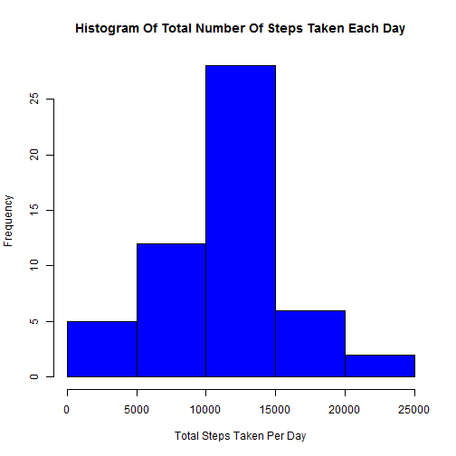
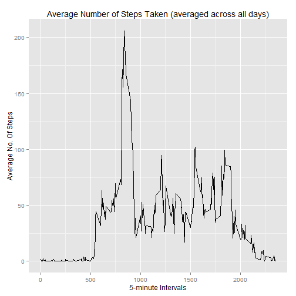
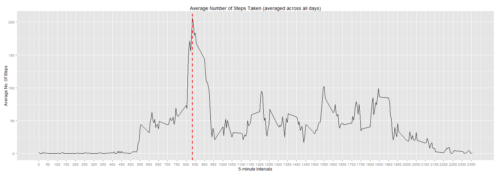
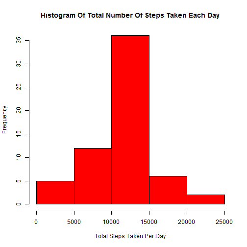
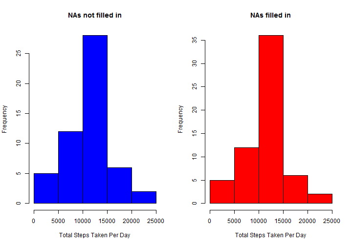
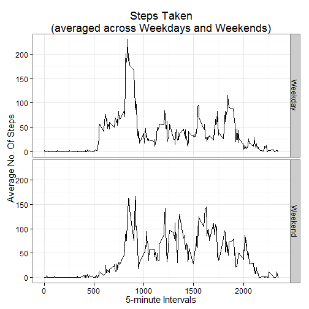

Reproducible Research - Peer Assessment Project I
===================
### *coded and reported by me, Deolu Adeleye*


## Obtaining the data, processing and transforming it

```r
library(dplyr, quietly=TRUE)
library(ggplot2)
library(lubridate)

###Decided to automate the entire download and loading process, to make it machine reproducible

##download the dataset
download.file(url="https://d396qusza40orc.cloudfront.net/repdata%2Fdata%2Factivity.zip",
              destfile="repdata-data-activity.zip")
##unzip it
unzip(zipfile="repdata-data-activity.zip",
      exdir = "repdata-data-activity")
##load it into our dataframe
initial<-read.csv('repdata-data-activity/activity.csv', header=TRUE, stringsAsFactors=FALSE,na.strings = "NA")

##see characteristics of dataset; display first few observations
str(initial)
```

```
## 'data.frame':	17568 obs. of  3 variables:
##  $ steps   : int  NA NA NA NA NA NA NA NA NA NA ...
##  $ date    : chr  "2012-10-01" "2012-10-01" "2012-10-01" "2012-10-01" ...
##  $ interval: int  0 5 10 15 20 25 30 35 40 45 ...
```

```r
##It is immediately observed that the 'date' column is in characters, not Date class.
##To know which format it is written in:
max(initial$date)
```

```
## [1] "2012-11-30"
```

```r
##Since the last figure is larger than the middle, it was recorded according to YEAR-MONTH-DAY format
##Converting 'date' column to Date class with appropriate year-month-day (ymd) function
initial$date<-ymd(initial$date)

##Convert dataset to tbl_df
activity<-tbl_df(initial)
##Re-arrange so that date is displayed first, then interval, then steps
activity<-activity %>% select(date, interval, steps)
##We may discard the initial dataset, as it won't be needed anymore
rm(initial)
##Show first few lines of new dataset
activity
```

```
## Source: local data frame [17,568 x 3]
## 
##          date interval steps
## 1  2012-10-01        0    NA
## 2  2012-10-01        5    NA
## 3  2012-10-01       10    NA
## 4  2012-10-01       15    NA
## 5  2012-10-01       20    NA
## 6  2012-10-01       25    NA
## 7  2012-10-01       30    NA
## 8  2012-10-01       35    NA
## 9  2012-10-01       40    NA
## 10 2012-10-01       45    NA
## ..        ...      ...   ...
```

## What is the mean total number of steps taken per day?
#### 1. Histogram of the total number of steps taken each day
To accomplish this, dataset was grouped by dates, and steps across each day summed.

```r
##First, dataset is grouped by dates
by_date<- activity %>% group_by(date)
##Next, grouped dataset is summarized to obtain total number of steps taken each day
tstepsperday<- by_date %>% summarize(total=sum(steps))
##Histogram is plotted
with(tstepsperday, hist(total, xlab="Total Steps Taken Per Day",
                        main="Histogram Of Total Number Of Steps Taken Each Day",
                        col="blue"))
```

 

*It is apparent that with the ```hist``` plot function, ```NA```s are automatically removed.
(To confirm this, the above may be plotted with the full code ```with(activity, hist(steps[!is.na(steps)]))```, and observe they are identical plots.)*

#### 2. The mean and median total number of steps taken per day

```r
##Mean
with(tstepsperday, mean(total, na.rm=TRUE))
```

```
## [1] 10766.19
```

```r
##Median
with(tstepsperday, median(total, na.rm=TRUE))
```

```
## [1] 10765
```
Ergo,
 - the mean total number of steps per day is **10766.19 steps** 
 - the median total number of steps per day is **10765 steps** 
 
## What is the average daily activity pattern?
#### 1. Time-series plot
Here, the activity dataset is now grouped by **intervals**, and the mean of steps across each day calculated (with ```NA```s removed).

```r
##Original dataset is grouped by intervals
by_interval<- activity %>% group_by(interval)
##Grouped dataset is summarized;
##Average no. of steps across all days for each interval is calculated
avgday<- by_interval %>% summarize(avg=mean(steps, na.rm=TRUE))
##Time-series plot
qplot(interval, avg, data=avgday, geom="line", xlab="5-minute Intervals", ylab="Average No. Of Steps",
      main="Average Number of Steps Taken (averaged across all days)")
```

 

#### 2. The 5-minute interval with the maximum number of steps?
The above plot indicates the value lies somewhere between the *750* and *1000* intervals. Perhaps a plot with more divisions and with the maximum indicated on its x-axis will yield a more accurate observation:

```r
ggplot(avgday, aes(x = interval, y = avg)) +
  ggtitle("Average Number of Steps Taken (averaged across all days)") +
  xlab("5-minute Intervals") + ylab("Average No. Of Steps") + geom_line() +
  scale_x_continuous(breaks=seq(from=0, to= max(avgday$interval), by = 50)) +
  geom_vline(aes(xintercept=avgday$interval[avgday$avg==max(avgday$avg)]),
             color="red",
             linetype="dashed", size=1)
```

 
This new plot, though still not precisely acccurate (any wider and the graph will become too wide for the document), at least tells the value lies between the *825* and *850* minute intervals.

Calculating the value manually confirms it:

```r
avgday$interval[avgday$avg==max(avgday$avg)]
```

```
## [1] 835
```
And so the **precise 5-minute interval** (on average across all the days in the dataset) that contains the maximum number of steps is the **835 minute interval**.

## Imputing missing values
#### 1. The total number of rows with NAs
Number of rows with missing values in the 'steps' column is retrieved thus:

```r
nrow(activity %>% filter(is.na(steps)))
```

```
## [1] 2304
```
The number of rows with missing values is **2304**
#### 2 & 3. Filling in all of the missing values in the dataset; Creating new dataset
The strategy adopted was to *use the mean for that 5-minute interval* (calculated earlier in our ```avgday``` grouped tbl_df).

```r
##First, a new dataset "wactivity" ("Weekly activity") identical to the original is created.
wactivity<-activity
##Test for NA values. If found, substitute for the mean value of that interval across all days
##using earlier summarized 'avgday'
for (i in 1:nrow(wactivity))
  {
  if(is.na(wactivity$steps[i]))
    { wactivity$steps[i]<-avgday$avg[avgday$interval==wactivity$interval[i]]}
  }
##Display first few lines of new dataset, showing NA values replaced with mean values.
wactivity
```

```
## Source: local data frame [17,568 x 3]
## 
##          date interval     steps
## 1  2012-10-01        0 1.7169811
## 2  2012-10-01        5 0.3396226
## 3  2012-10-01       10 0.1320755
## 4  2012-10-01       15 0.1509434
## 5  2012-10-01       20 0.0754717
## 6  2012-10-01       25 2.0943396
## 7  2012-10-01       30 0.5283019
## 8  2012-10-01       35 0.8679245
## 9  2012-10-01       40 0.0000000
## 10 2012-10-01       45 1.4716981
## ..        ...      ...       ...
```

#### 4.
##### a. Histogram of the total number of steps taken each day; NAs filled in
Like before, the new dataset is grouped by dates, and steps across each day summed.

```r
##First, dataset is grouped by dates
wby_date<- wactivity %>% group_by(date)
##Next, grouped dataset is summarized to obtain total number of steps taken each day
wtstepsperday<- wby_date %>% summarize(total=sum(steps))
##Histogram is plotted
with(wtstepsperday, hist(total, xlab="Total Steps Taken Per Day",
                        main="Histogram Of Total Number Of Steps Taken Each Day",
                        col="red"))
```

 

##### b. The mean and median total number of steps taken per day; NAs filled in

```r
##Mean with NAs filled in
with(wtstepsperday, mean(total))
```

```
## [1] 10766.19
```

```r
##Median with NAs filled in
with(wtstepsperday, median(total))
```

```
## [1] 10766.19
```
Ergo, with missing values filled,
 - the mean total number of steps per day in *remains* **10766.19 steps** 
 - the median total number of steps per day is *now* **10766.19 steps** as well.
 
Comparing the results of *before* and *after* the ```NA``` values were filled in, it is observable that **there is not much of a difference**, most likely because the values were filled in with the mean across all days.

*Just to compare, both histograms are plotted side by side below:*

```r
par(mfrow=c(1,2),"bg"="white")
with(tstepsperday, hist(total, xlab="Total Steps Taken Per Day",
                        main="NAs not filled in",
                        col="blue"))
with(wtstepsperday, hist(total, xlab="Total Steps Taken Per Day",
                        main="NAs filled in",
                        col="red"))
```

 

## Are there differences in activity patterns between weekdays and weekends?
#### 1. New factor variable -- "weekday" and "weekend" levels

```r
##A holder vector for the new factor is first created, and set to NULL
test<-NULL
for (i in 1:nrow(wactivity))
{
  if(weekdays(wactivity$date[i])=="Saturday"|weekdays(wactivity$date[i])=="Sunday")
    {
    test<-c(test,"Weekend")
    }
  else test<-c(test,"Weekday")
  ##The above loop will populate the vector with the corresponding "Weekday" and "Weekend" values
}
##Finally, this populated vector is coerced into a factor,
##and then inserted into the dataset's newly created factor column "day"
wactivity$day<-factor(test)

rm("test","i") ##these vectors may now be discarded.

##A little re-arrangment, so that the factor shows beside the date,
##immediately indicating if it's a Weekday or Weekend
wactivity <- wactivity %>% select(date, day, interval, steps)

##First few lines of the new dataset with the factor column displayed
wactivity
```

```
## Source: local data frame [17,568 x 4]
## 
##          date     day interval     steps
## 1  2012-10-01 Weekday        0 1.7169811
## 2  2012-10-01 Weekday        5 0.3396226
## 3  2012-10-01 Weekday       10 0.1320755
## 4  2012-10-01 Weekday       15 0.1509434
## 5  2012-10-01 Weekday       20 0.0754717
## 6  2012-10-01 Weekday       25 2.0943396
## 7  2012-10-01 Weekday       30 0.5283019
## 8  2012-10-01 Weekday       35 0.8679245
## 9  2012-10-01 Weekday       40 0.0000000
## 10 2012-10-01 Weekday       45 1.4716981
## ..        ...     ...      ...       ...
```


```r
##The new dataset with the factor dayiable is summarized by intervals AND factor, in that order
wby_interval<- wactivity %>% group_by(interval,day)
##Grouped dataset is summarized;
##Average no. of steps across all days for each interval is calculated;
##as well as indicating if said interval falls on a weekday or weekend
wavgday<- wby_interval %>% summarize(avg=mean(steps))

##Time-series Plot, with Weekdays and Weekend compared
qplot(x=interval, y=avg, data=wavgday, geom="line", facets=day~.,
      xlab="5-minute Intervals", ylab="Average No. Of Steps") +
  theme_bw(base_size = 15) +
  ggtitle("Steps Taken\n(averaged across Weekdays and Weekends)")
```

 

Based on observations of the above plot, we can conclude that *initially* there is a difference between activity on weekdays and weekends, with more initially on weekdays, and a more even average across the *750* and *1750* intervals on weekends.

*Thank you.*
